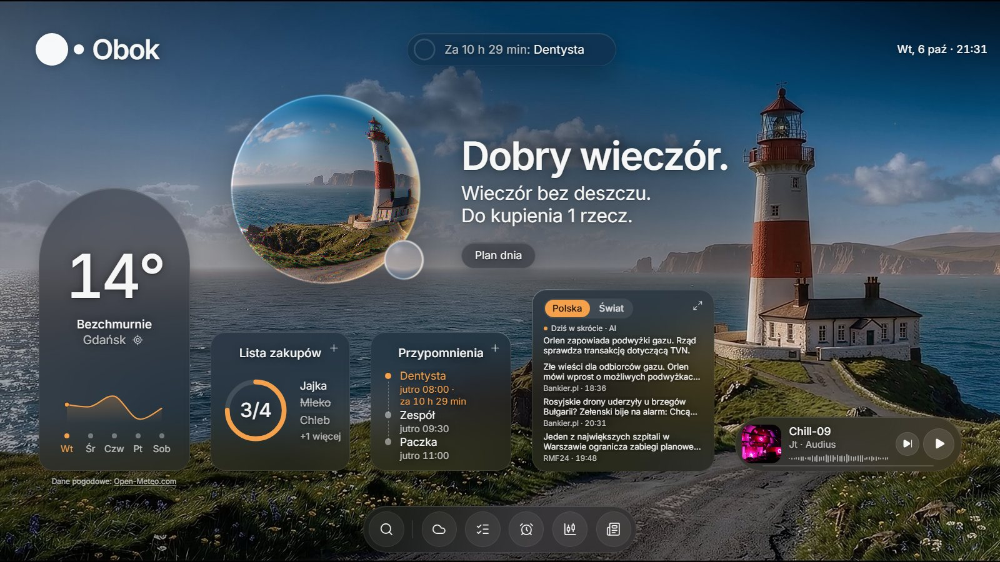
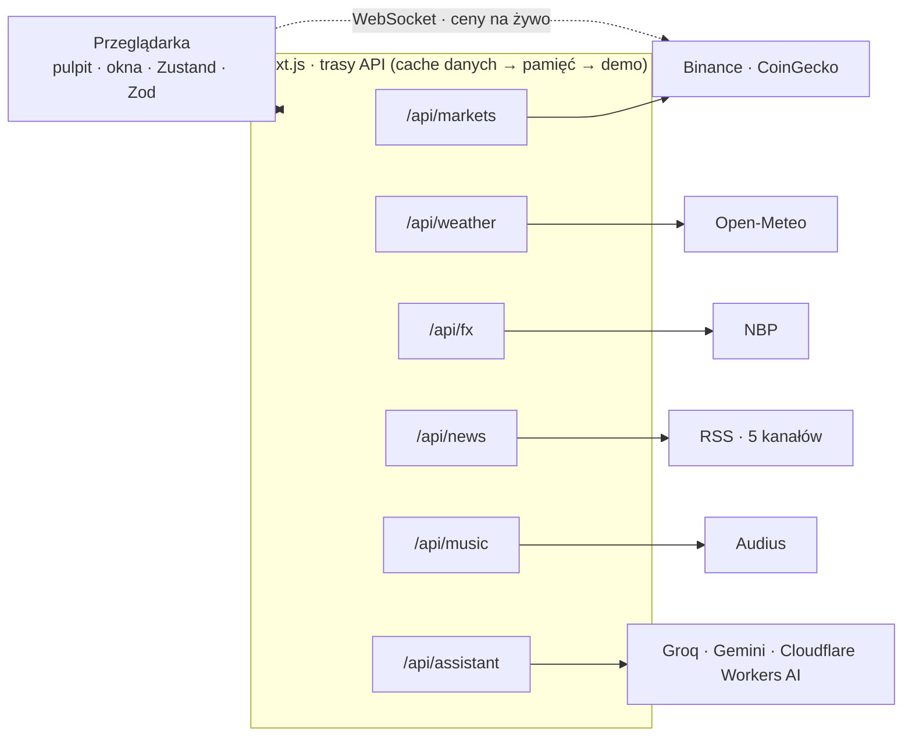

# Obok

> Twój dzień, obok ciebie.

Webowy „system operacyjny” dnia w estetyce dymnego, płynnego szkła: pogoda, lista zakupów, przypomnienia, rynki i wiadomości na żywo, osadzone w scenie latarni morskiej, która zmienia się razem z prawdziwą pogodą i porą dnia.

**Na żywo:** [oh-bok.vercel.app](https://oh-bok.vercel.app) · **wycieczka (ok. 75 s, w pętli):** [oh-bok.vercel.app/?demo=1](https://oh-bok.vercel.app/?demo=1)



## Najważniejsze funkcje

- **Żywa scena:** pętle wideo latarni dla pogody × pory dnia (dzień, złota godzina ±45 min wokół wschodu i zachodu, noc). Deszcz, śnieg, mgła, pioruny i snop latarni są rysowane w kodzie. Przejścia trwają 1,4 s, a zmiana samej pory 15 s. Kontrast tekstu ≥ 4,5:1 zmierzony w każdej scenie.
- **Kula „Obok”:** własny shader WebGL2 (refrakcja sceny, krople deszczu na szkle, stany asystenta). Kompilacja w tle, a na słabszych urządzeniach zastępuje ją kula w CSS.
- **Podróż w czasie:** najechanie na dzień prognozy pokazuje jego pogodę w kuli, kliknięcie zmienia całą scenę.
- **Spotlight (Ctrl/Cmd+K):** lokalny parser komend po polsku z własnym parserem dat („przypomnij mi jutro o 9 o dentyście”, „dodaj mleko i jajka”). Akcje lecą do celu i można je cofnąć. Czego parser nie rozumie, trafia do asystenta.
- **Asystent:** strumieniowane odpowiedzi z failoverem dostawców (Groq → Gemini → Cloudflare), limity zapytań na IP. Model zwraca komendy jako dane walidowane przez Zod i nie dostaje nowych uprawnień.
- **Rynki:** ceny z WebSocketu Binance z licznikiem cyfr, wykresem i alertami cenowymi. Maszyna stanów kanału z backoffem przełącza na zapas (CoinGecko) bez udziału użytkownika. Kurs USD/PLN z NBP.
- **Wiadomości:** nagłówki z kanałów RSS z deduplikacją i rankingiem, do tego „Dziś w skrócie”: jedno streszczenie AI na godzinę, wspólne dla wszystkich.
- **Muzyka:** utwory z Audius dobrane do pogody, Media Session, artyści zawsze podpisani.
- **System okien:** przejścia współdzielone z kafelka lub docka, przeciąganie z bezwładnością, adres `?app=` jako źródło prawdy („wstecz” zamyka okno), arkusze na telefonie.
- **Odporność:** każde źródło ma cache, ostatnie dane i tryb demo z widocznym oznaczeniem, więc strona nie wysypuje się przy awarii API.
- **Dostępność:** pełna obsługa klawiatury, role ARIA, `prefers-reduced-motion` respektowane wszędzie, limit błysków (WCAG 2.3.1).

## Architektura



- **Backend dla frontendu:** wszystkie zewnętrzne API przechodzą przez własne trasy. Klucze zostają na serwerze, dane są normalizowane do jednego formatu i walidowane Zodem.
- **Cache danych Next.js** (`fetch` z `revalidate` i tagami) jest trwały i wspólny dla instancji. Gdy źródło nie odpowiada, trasa oddaje ostatnie dobre dane z pamięci instancji, a w ostateczności dane demo. Nagłówki `x-obok-cache: hit|miss|stale|demo` i `x-obok-provider` pokazują, co się wydarzyło.
- **Stan klienta** jest w Zustand z zapisem w localStorage. Każdy odczyt przechodzi walidację Zod, a uszkodzony zapis daje stan domyślny zamiast błędu.

## Technologie

Next.js 16 (App Router) · React 19 · TypeScript (strict, bez `any`) · Tailwind CSS 4 · Motion · Zustand · Zod · WebGL2 (własny shader) · Lucide · Vitest · Playwright · Vercel

## Uruchomienie lokalne

Wymagania: Node.js 20+ i [pnpm](https://pnpm.io/).

```bash
pnpm install
cp .env.example .env.local   # opcjonalnie: klucze asystenta i limitów
pnpm dev                     # http://localhost:3000
```

Bez kluczy strona działa w pełni, poza asystentem (pokazuje komunikat) i współdzielonym limitem zapytań (liczony w pamięci serwera).

| Zmienna | Do czego |
|---|---|
| `GROQ_API_KEY` | asystent: Groq |
| `GEMINI_API_KEY` | asystent: Google Gemini |
| `CLOUDFLARE_ACCOUNT_ID` | asystent: Cloudflare Workers AI |
| `CLOUDFLARE_API_TOKEN` | asystent: Cloudflare Workers AI |
| `AI_PROVIDER_ORDER` | kolejność failoveru, np. `groq,gemini,cloudflare` |
| `GROQ_MODEL` | opcjonalnie: inny model Groq |
| `GEMINI_MODEL` | opcjonalnie: inny model Gemini |
| `CLOUDFLARE_MODEL` | opcjonalnie: inny model Cloudflare |
| `UPSTASH_REDIS_REST_URL` | limit zapytań wspólny dla instancji (Upstash Redis) |
| `UPSTASH_REDIS_REST_TOKEN` | j.w. |
| `COINGECKO_API_KEY` | opcjonalnie: klucz planu demo CoinGecko |

Przydatne parametry adresu: `?demo=1` (wycieczka), `?app=pogoda|lista|przypomnienia|rynki|wiadomosci|o-systemie` (okna), `?weather=sunny|cloudy|fog|drizzle|rain|snow|storm` i `?time=day|golden|night` (scena), `?boot=off` (bez sekwencji startu).

## Testy

```bash
pnpm test        # Vitest: logika w lib/ (parser komend i dat, sceny, rynki, wiadomości, asystent…)
pnpm test:e2e    # Playwright: scenariusze w przeglądarce (sam uruchamia serwer deweloperski)
pnpm lint
pnpm typecheck
```

## Prywatność

Dokładna pozycja nie opuszcza przeglądarki. Po zgodzie zapisujemy tylko zaokrągloną lokalizację (~1 km) w ciasteczku `obok-loc`. Lista, przypomnienia, alerty, waluta i pozycje okien leżą w localStorage (`obok-*`). Okno „O systemie” pokazuje wszystkie zapisane klucze i pozwala je usunąć („Wyczyść moje dane”). Tryb demo działa na kopii w pamięci i nie zmienia danych użytkownika.

## Atrybucje

- **Pogoda:** [Open-Meteo.com](https://open-meteo.com/) (CC BY 4.0). Darmowe API tylko do użytku niekomercyjnego.
- **Rynki:** [Binance](https://www.binance.com/) (publiczne dane rynkowe), [CoinGecko](https://www.coingecko.com/) (Data provided by CoinGecko), [NBP](https://nbp.pl/) (kurs USD/PLN, tabela A).
- **Wiadomości:** [RMF24](https://www.rmf24.pl/), [Bankier.pl](https://www.bankier.pl/), [Euronews](https://pl.euronews.com/), [DW](https://www.dw.com/pl/). Pokazujemy tylko nagłówki z nazwą źródła i linkiem do artykułu.
- **Muzyka:** [Audius](https://audius.co/). Artyści są podpisani przy każdym utworze.
- **Asystent:** [Groq](https://groq.com/), [Google Gemini](https://ai.google.dev/), [Cloudflare Workers AI](https://developers.cloudflare.com/workers-ai/).
- **Ikony:** [Lucide](https://lucide.dev/) (ISC). **Krój:** [Inter](https://rsms.me/inter/) (SIL OFL).
- **Sceny i postacie:** Nano Banana Pro, Veo.

## Autor

Piotr Goworek, GOVO DIGITAL: [govodigital.vercel.app](https://govodigital.vercel.app) · [LinkedIn](https://www.linkedin.com/in/piotrgoworek)
